# 计算机系统基础笔记


$$
(DAY)^{-1}
$$


## 一.早期冯诺依曼机

控制器：指挥程序运行

特点：

- 五大件
- 指令和数据以同等地位存于存储器
- 指令和数据为二进制
- 指令由操作码和地址码组成
- 存储程序
- 以运算器为主

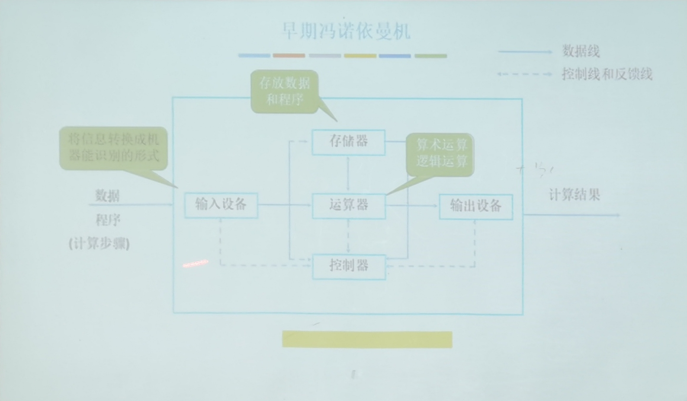

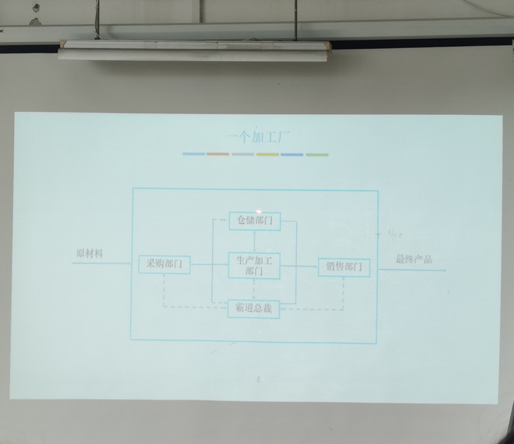

 

## 二.现代计算机结构


以存储器为中心

### 1.CPU：运算器+控制器


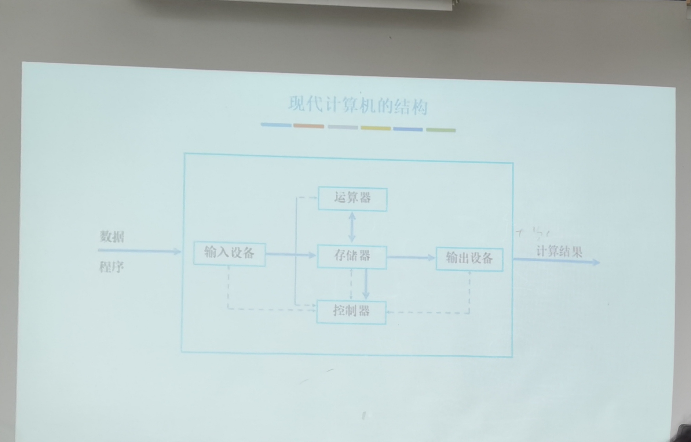

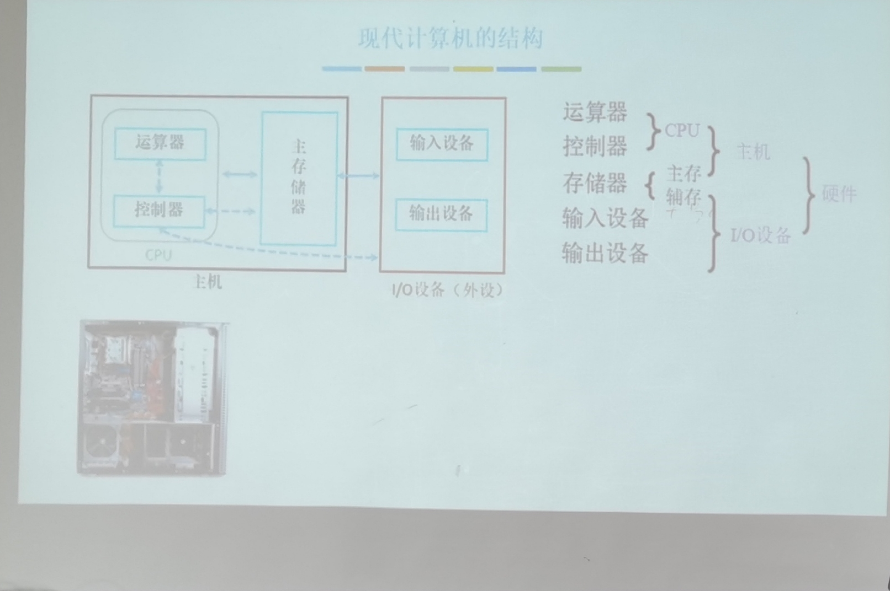


### 2.主存储器

- MAR 存储地址寄存器
  - 反映存储单元的个数
- MDR 存储数据寄存器
  - 反映存储字长


### 3.存储体

- 存储单元 存放一串二进制代码
- 存储字 二进制代码组合
- 存储字长 二进制位数
- 存储元 存储二进制电子元件，1bit


### 4.运算器

实现算数运算

- ACC 累加器
- MQ  乘商运算器
- X
- ALU


### 5.控制器

- CU 分析指令，发送控制信号
- IR 指令寄存器 存放当前执行指令
- PC 程序计数器，存放下一条指令


## 三.计算机工作过程


## 四.定点数编码


| $\text{n+1 bit}$ |       合法表示范围        |                          最大数                           |                       最小数                        |                         真值0的表示                          |
| :--------------: | :-----------------------: | :-------------------------------------------------------: | :-------------------------------------------------: | :----------------------------------------------------------: |
| 带符号整数：原码 | $-(2^n-1)\leq x\leq2^n-1$ | $\begin{array}{c}\mathbf{0},111...111\\=2^n-1\end{array}$ | $\begin{array}{c}1,111...111\\=-(2^n-1)\end{array}$ | $\begin{array}{c} [+0]_{\text{原}} = 0 , 0 0 0 \ldots 0 0 0 \\ [-0]_{\text{原}} = 1 , 0 0 0 \ldots 0 0 0 \end{array}$ |
| 带符号整数：反码 | $-(2^n-1)\leq x\leq2^n-1$ | $\begin{array}{c}\mathbf{0},111...111\\=2^n-1\end{array}$ | $\begin{array}{c}1,111...111\\=-(2^n-1)\end{array}$ | $\begin{array}{c} [+0]_{\text{原}} = 0 , 0 0 0 \ldots 0 0 0 \\ [-0]_{\text{原}} = 1 , 1 1 1 \ldots 1 1 1 \end{array}$ |
| 带符号整数：补码 |   $-2^n\leq x\leq2^n-1$   | $\begin{array}{c}\mathbf{0},111...111\\=2^n-1\end{array}$ |   $\begin{array}{c}1,111...111\\=-2^n\end{array}$   | $\begin{array}{c} [+0]_{\text{补}} = 0 , 0 0 0 \ldots 0 0 0 \\ \text{真值0只有一种补码} \end{array}$ |
|    无符号整数    |  $0\leq x\leq2^{n+1}-1$   |    $\begin{array}{c}1111...111\\=2^{n+1}-1\end{array}$    |    $\begin{array}{c}1,000...000\\=0\end{array}$     |                         $0000...000$                         |


### 1.反码

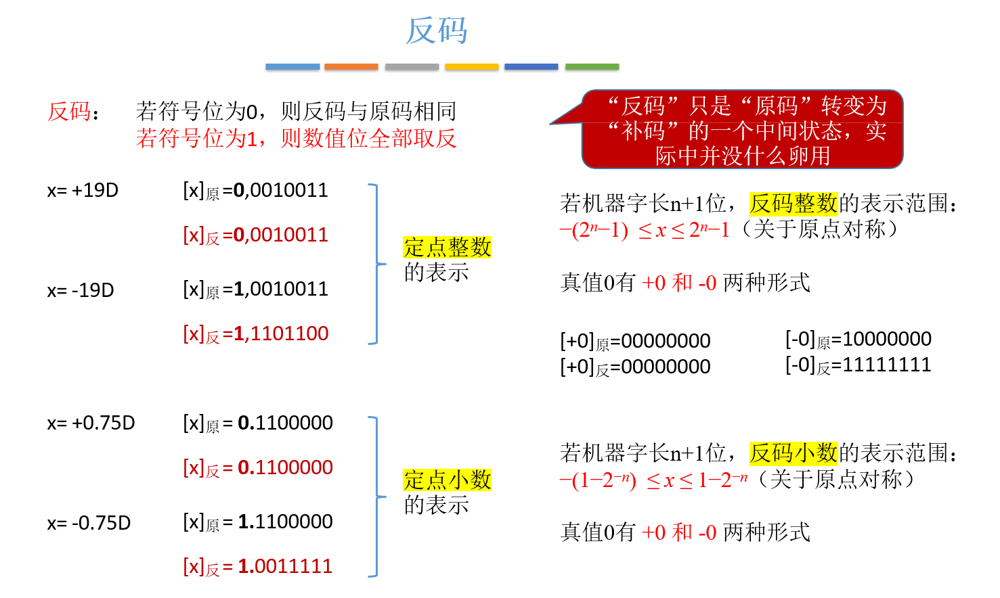


### 2.补码

当要完成这个转换
$$
\ [B]_\text{补} \rightarrow [-B]_\text{补}
$$
仅需将$\ [B]_\text{补}$ 按照 按位取反加一的方式转换即可**（包括符号位）**

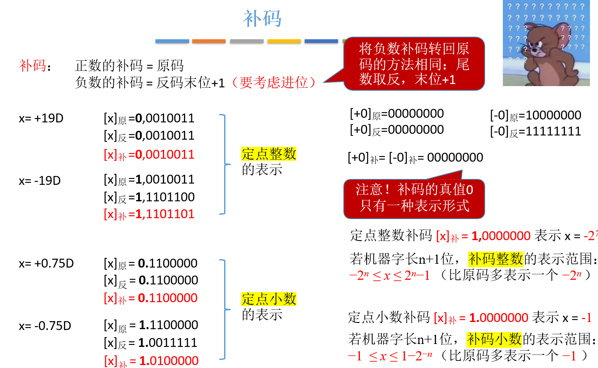

快捷方式（负数）：第一个1不变，符号位不变，其余取反

注：有2个特殊补码： 1111 （-1） 1000（-8）？


## 五. 算术逻辑单元（ALU）的作用


组合逻辑电路：只与输出和输入有关

时序逻辑电路：

ALU的核心是加法器


## 六. 加法器


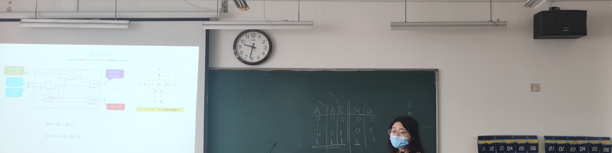


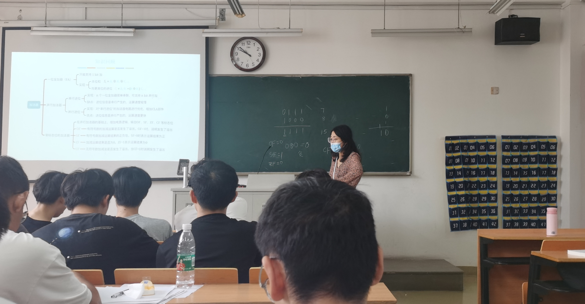


## 七. 定点数


### 1.移位运算

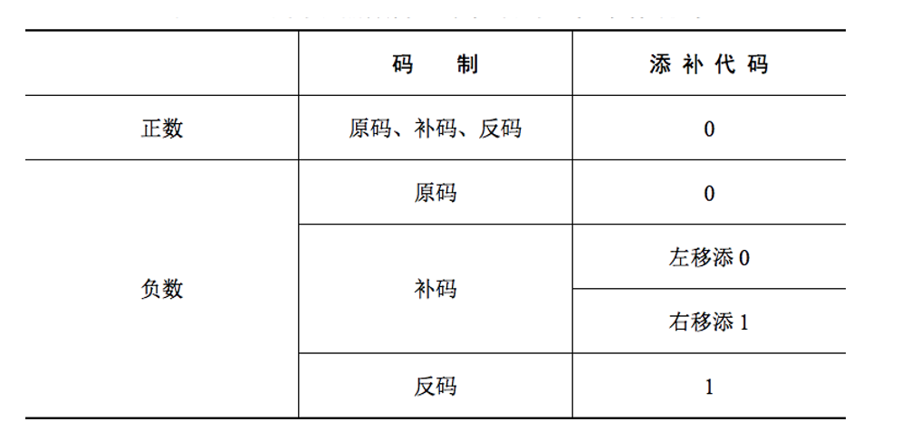

### 2.加减法


- 直接用原码加减可能会出错

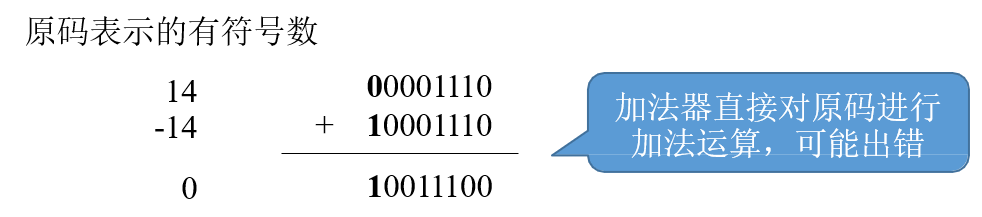


- 计算结果溢出

在-127~127范围内（8位机器数，含符号位）的数据进行计算 120+16=136，计算结果会溢出。

`0` 111 1000  + `0` 001 0000 = `1` 000 1000 （第一个为符号位）

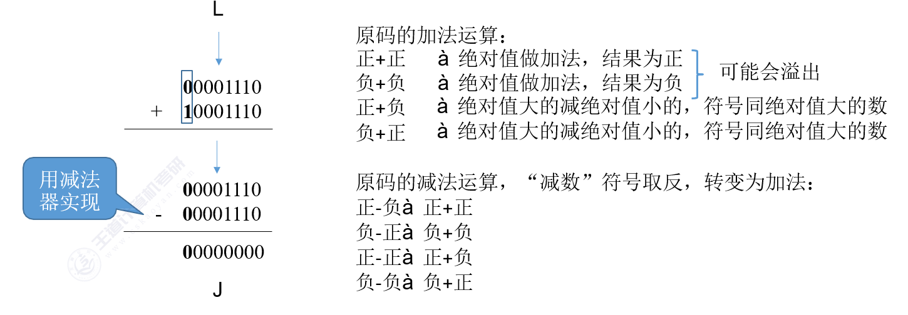


### 3.无符号和有符号数计算


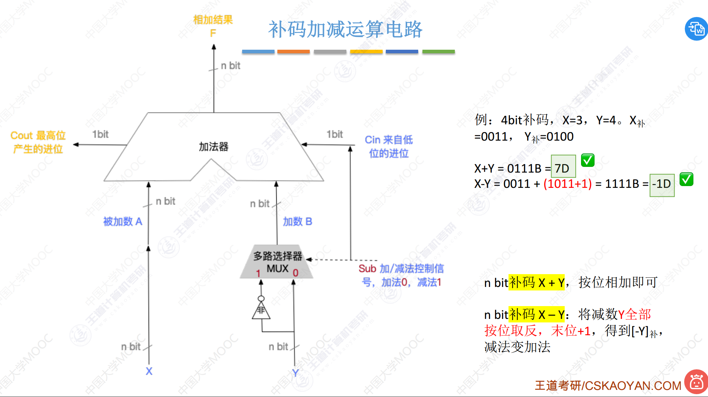

- 标志位

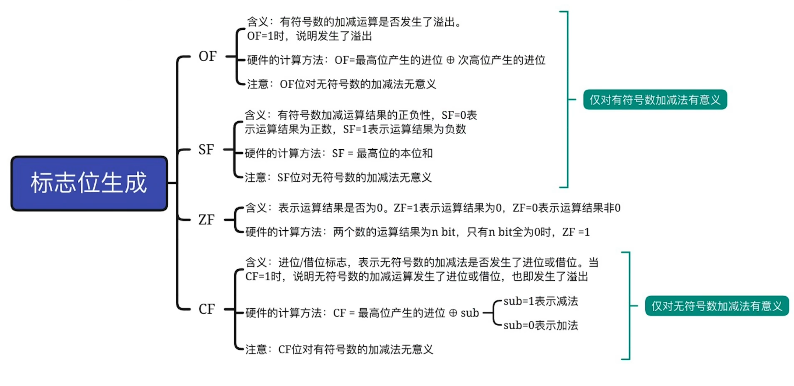


- $OF（Overflow Flag)$溢出标志，用于判断**带符号数**加减运算是否溢出。
  - $OF=1$ 溢出
  - $OF=0$ 未溢出

```json
OF:次高位进位和最高位进位异或

0b1000 + 0b1000 --> 0b0000
OF --> 1

0b1011 + 0b0100 --> 0b1111
OF --> 0
```


- $SF（Sign Flag）$符号标志，用于判断**带符号数**加减运算结果的正负性 。
  - $SF=1$ 结果为负
  - $SF=0$ 结果为正

```json
最高位本位
```


- $ZF（Zero Flag)$零标志，用于判断加减运算结果是否为0。

  - $ZF=1 $表示结果为0
  - $ZF=0$表示结果不为0

  

  

- $CF（Carry Flag)$进位/借位标志，用于判断**无符号数**加减运算是否溢出。

  - $CF=1$ 溢出
  - $CF=0 $未溢出

```json
无符号数的最高位进位为1异或sub，CF=1，否则CF=0
0b1111 + 0b0001 --> 0b0000
CF --> 1

0b0111 + 0b0001 --> 0b1000
CF --> 0
```


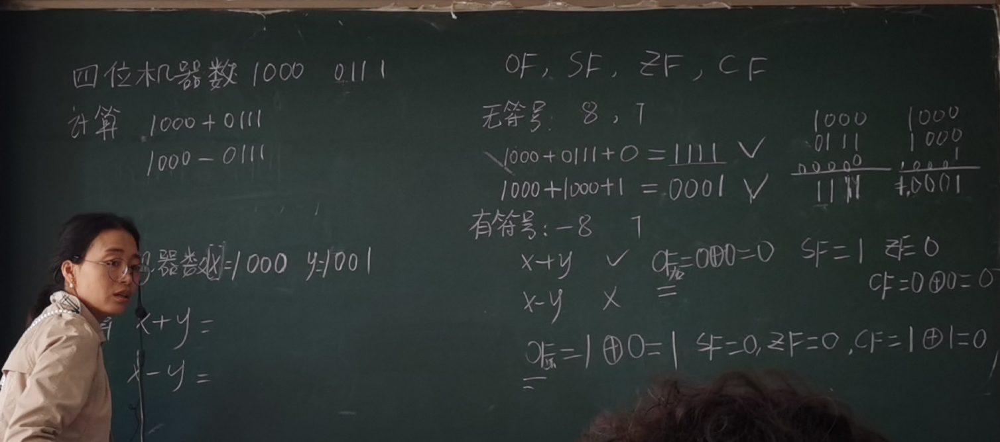


### 3.原码乘法运算

- 手算十进制

$$\begin{aligned}\mathsf{r}&\text{进制:}\quad K_{\mathbf{n}}K_{\mathbf{n-1}}\ldots K_{\mathbf{2}}K_{\mathbf{1}}K_{\mathbf{0}}K_{-1}K_{-2}\ldots K_{-m}\\&=K_{\mathbf{n}}\times r^{\mathbf{n}}+K_{\mathbf{n-1}}\times r^{n-1}+\cdots+K_{\mathbf{2}}\times r^{\mathbf{2}}+K_{\mathbf{1}}\times r^{\mathbf{1}}+K_{\mathbf{0}}\times r^{\mathbf{0}}+K_{\mathbf{-1}}\times r^{-1}+K_{\mathbf{-2}}\times r^{-\mathbf{2}}+\ldots+K_{-m}\times r^{-m}\end{aligned}$$

$$
\begin{equation*}
\begin{array}{r}
    & 0.985 \\
  \times & 0.211 \\
\hline
    &  985 \\
    &  985\phantom{0} \\
    &  1970\phantom{00} \\
\hline
    & 0.207835 \\
\end{array}
\quad \rightarrow \quad
\begin{array}{r}
    & 0.985 \\
  \times & 0.211 \\
\hline
    & 0.000985 \\
    & 0.00985\phantom{0} \\
    & 0.1970\phantom{00} \\
\hline
    & 0.207835 \\
\end{array}
\end{equation*}
$$

$$
\begin{array}{l}0.211=2\times10^{-1}+1\times10^{-2}+1\times10^{-3}\\0.985=985\times10^{-3}\end{array}
$$

$$
0.985\times0.211=(985\times1\times10^{-6})+(985\times1\times10^{-5})+(985\times2\times10^{-4})
$$

- 手算二进制

$$
\begin{equation*}
\begin{array}{r}
    & 0.1101 \\
  \times & 0.1011 \\
\hline
    & 1101 \\
    & 1101\phantom{0} \\
    & 0000\phantom{00} \\
    & 1101\phantom{000} \\
\hline
    & 0.10001111 \\
\end{array}
\quad \rightarrow \quad
\begin{array}{r}
    & 0.1101 \\
  \times & 0.1011 \\
\hline
    & 0.00001101 \\
    & 0.0001101\phantom{0} \\
    & 0.000000\phantom{00} \\
    & 0.01101\phantom{000} \\
\hline
    & 0.10001111 \\
\end{array}
\end{equation*}
$$

$$
\begin{align*}
&\text{乘数}  : 0.1011 = 1\times2^{-1} + 0\times2^{-2} + 1\times2^{-3} + 1\times2^{-4} \\
&\text{被乘数}  : 0.1101 = 1101\times2^{-4} \\
&0.1101\times0.1011=(1101\times1\times2^{-8})+(1101\times1\times2^{-7})+(1101\times0\times2^{-6})+(1101\times1\times2^{-5})
\end{align*}
$$


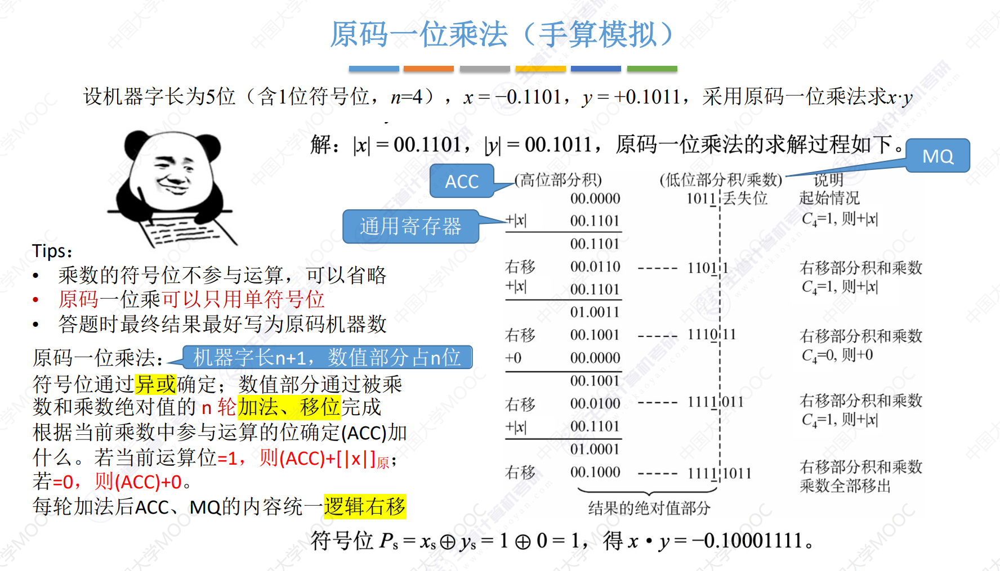


### 4.补码乘法


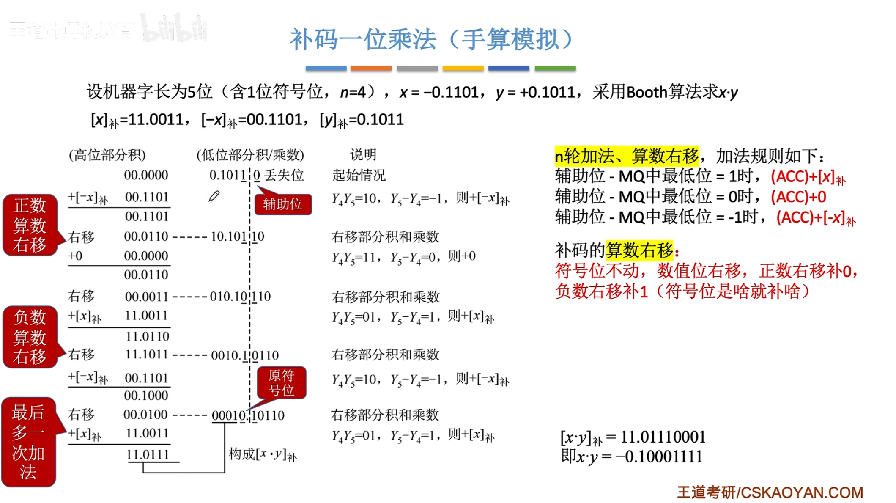


### 5.原码除法(?????)

恢复余数法（作业）


## 八. 浮点数


### 1. 浮点数的表示

阶码、尾数均用补码表示

例：阶码、尾数均用补码表示，求a、b的真值
$$
a = 0,01;1.1001
$$

$$
b = 0,10;0.01001
$$

a： 阶码 $0,01$ 对应真值 $+1$
尾数 $1.1001$ 对应真值 $-0.0111 = 2^{1}\times(-\left(2^{-2}+2^{-3}+2^{-4}\right))$

a 的真值 $=2^{1} \times(-0.0111)=-0.111$

|      | 阶符 | 阶码数值部分 | 数符 | 尾数的数值部分 |                                                           |
| :--: | :--: | :----------: | :--: | :------------: | :-------------------------------------------------------: |
|  a   |  0   |      01      |  1   |      1001      | $2^{1}\times(-\left(2^{-2}+2^{-3}+2^{-4}\right)) =-0.111$ |
|  b   |  0   |      10      |  0   |     01001      |    $2^{2}\times(+\left(2^{-2}+2^{-5}\right)) = +1.001$    |
|      |      |              |      |                |                                                           |


### 2. 规格化浮点数

规格化浮点数：规定尾数的最高数值位必须是一个有效值 。

左规：当浮点数运算的结果为非规格化时要进行规格化处理，将尾数算数左移一位，阶码减1。

右规：当浮点数运算的结果尾数出现溢出（双符号位为01或10）时，将尾数算数右移一位，阶码加1。

求a+b

$$
\begin{align}
&a=2^{2}\times00.1100, \\
& b=2^{2}\times00.1000,  \\
a+b& =2^{2}\times00.1100+2^2\times00.1000,  \\
&=2^{2}\times(00.1100+00.1000), \\
&=2^{2}\times01.0100, \\
&=2^{3}\times00.1010
\end{align}
$$


### 作业

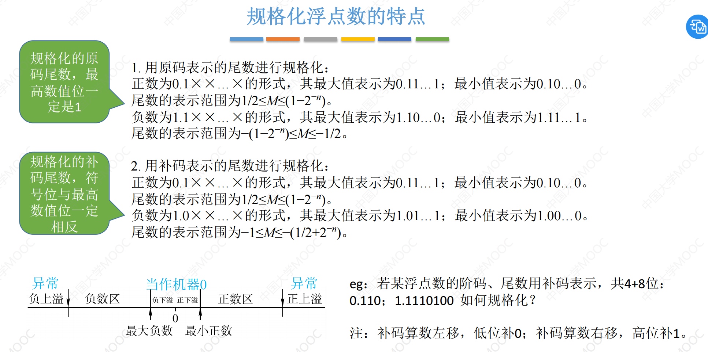

### 3.浮点数的加减运算

例：已知十进制数$X=−5/256、Y=+59/1024$，按机器补码浮点运算规则计算$X−Y$，结果用二进制表示，浮点数格式如下：阶符取$2$位，阶码取$3$位，数符取$2$位，尾数取$9$位用

使用补码表示阶码和尾数
$$
X = \frac{−5}{256} \\ Y = \frac{+59}{1024}
$$

$$
X = -5 = 1.101 =11.011
$$

$$
Y = +59 = 0.111011 = 00.111011
$$


|      | 阶符 | 阶码数值部分 | 数符 | 尾数的数值部分 |                                                              |
| :--: | :--: | :----------: | :--: | :------------: | :----------------------------------------------------------: |
|  X   |  11  |     011      |  11  |   011000000    | $\begin{align}X &= -101\times2^{-8} \\ &= -0.101\times2^{-8+3} \\ &= -0.101\times2^{-5} \\ &= -0.101\times2^{-101} \\ &= 11.011\times2^{11.011}\end{align}$ |
|  Y   |  11  |     100      |  00  |   111011000    | $\begin{align}Y &= +111011\times2^{-10} \\  &= +0.111011\times2^{-10+6} \\  &= +0.111011\times2^{-4} \\ &= +0.111011\times2^{-100} \\  &= 00.111011\times2^{11.100}\end{align}$ |


#### （1）对阶

- 求阶差小阶向大阶看齐，尾数毎右移一位，阶码加1

$$
\begin{align}[\Delta_j]_补 &= [j_x]_补 + [j_y]_补  \\&= 11.011 + 00.100 \\&= 11.111 \\&=-1_D\end{align}
$$


上述计算表示 $X$ 的阶数小于 $Y$ 的阶数，因此需要将 $X$ 算术右移

- 对阶

$$
\begin{align}X =& 11.100,11.1011000 \\ = & -0.0101\times2^{-100}\end{align}
$$

#### （2）尾数加减

$$
\begin{equation}
\begin{array}{l}X-Y \\ =\left(-0.0101 \times 2^{-100}\right)-\left(+0.111011 \times 2^{-100}\right) \\ =(-0.0101-0.111011) \times 2^{-100} \\ =-1.001111 \times 2^{-100}\end{array}
\end{equation}
$$

$$
\begin{align}[Y]_补 =& 11.100,00.111011000 \\
[-Y]_补 =& 11.100,11.000101000 \\
[X]_补 =& 11.100,11.101100000\end{align}
$$

$$
X-Y:(尾数加减)\\ \begin{equation}
\begin{array}{r}11.101100000 \\ +\quad 11.000101000 \\ \hline 10.110001000\end{array}
\end{equation}
$$

#### （3）规格化

- 右规

当结果尾数的两个符号位的值不同时，表明尾数运算结果溢出。此时应使结果尾数右移一位，并使阶码的值加1。
$$
\begin{equation}
X-Y: \quad 11[100],[10].110001000 \rightarrow 11[101],[11].011000100
\end{equation}
$$

- 左规

当尾数的运算结果不溢出，但最高数值位与符号位同值，表明不满足规格化规则，此时应重复地使尾数左移、阶数减1，直到出现在最高数值位上的值与符号位的值不同为止。
$$
\begin{align}A =& 11.011,11.011000000\\
B =& 11.100,11.111011000\end{align}
$$

$$
A-B:11[100],[11].110001000 \rightarrow 11[010],[11].000100000
$$


#### （4）舍入

- 0舍1入:被舍去的末尾是0直接舍去，末尾为1再 $+1$ ，这样做可能会使尾数又溢出，此时需再做一次右规。

$$
\begin{equation}
\begin{aligned} 11100,10.110001011 & \rightarrow 11101,11.011000101\1 \\ & \rightarrow 11101,11.011000110\1\end{aligned}
\end{equation}
$$

- 恒置$1$:尾数右移时，不论丢掉的最高数值位是“1”还是“0”，都使右移后的尾数末位恒置“1”。这种方法同样有使尾数变大和变小的两种可能。

$$
\begin{equation}
\begin{aligned} 11100,10.110001011 & \rightarrow 11101,11.011000101\1 \\ & \rightarrow 11101,11.011000101\1\end{aligned}
\end{equation}
$$


#### （5）判溢出 

- 阶码 $+1$ 后符号位是否相同

$$
11.100+1 = 11.101 \\
符号位11相同未溢出
$$