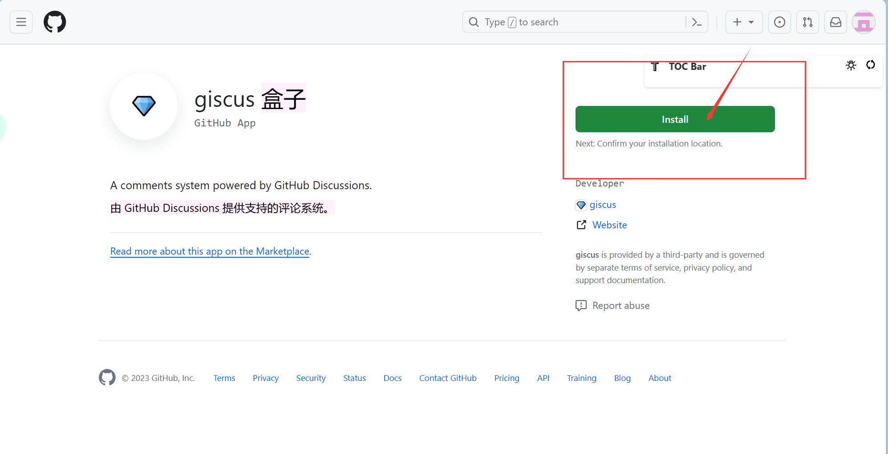
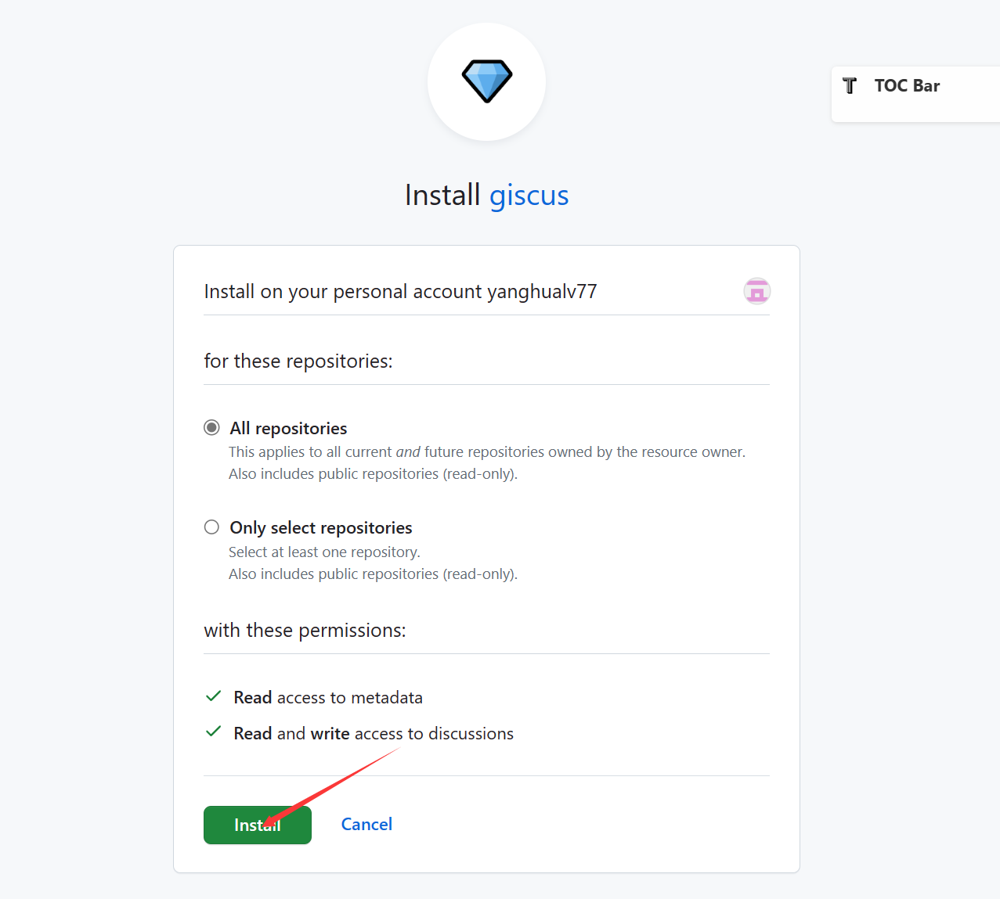
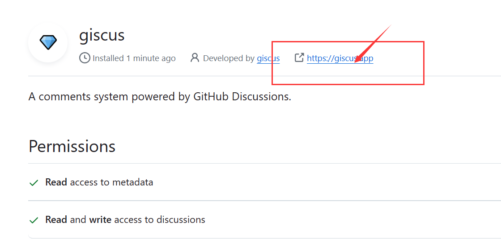
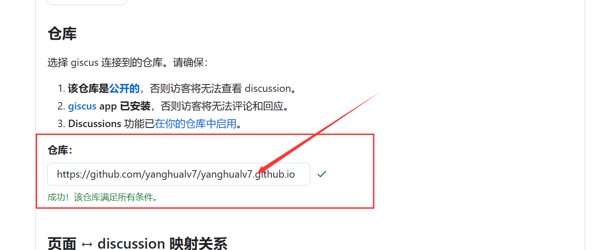
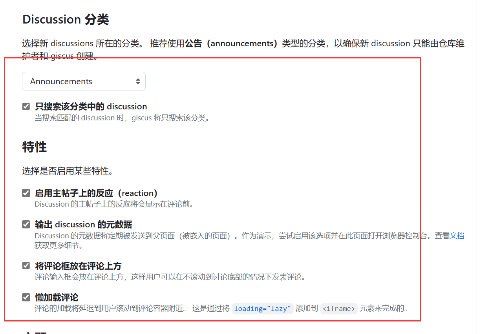
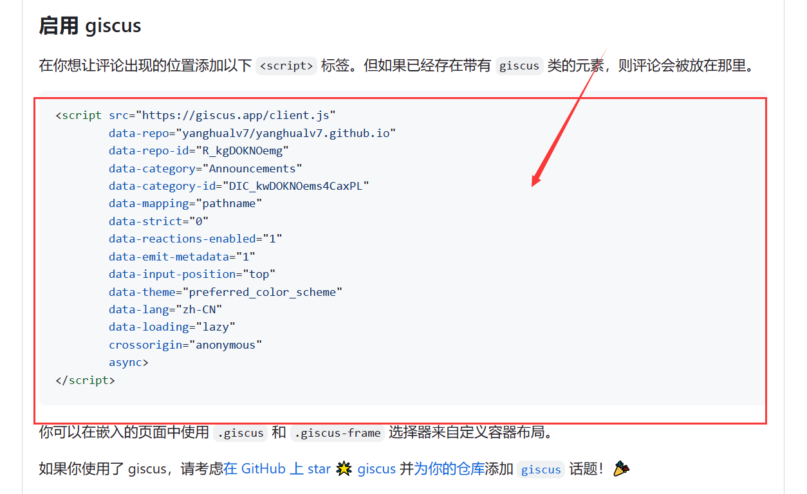

# mkdocs-添加评论功能

[参考资料Material for MkDocs Adding a comment system](https://squidfunk.github.io/mkdocs-material/setup/adding-a-comment-system/)


## 1.yml文件配置

```yml
markdown_extensions:
  pymdownx.critic：用于添加批注和评论功能。
theme：
  custom_dir: overrides
```


## 2.所需依赖

使用pip安装以下依赖

```txt
Markdown
pymdown-extensions
```


## 3.新建overrides文件夹

**overrides**文件夹存放一个`main.html`文件，此文件用于配置评论系统[giscus](https://giscus.app/zh-CN)的配置文件

在使用 [Giscus ](https://giscus.app/)之前，您需要完成以下步骤：

### (1)**安装 [Giscus GitHub 应用程序 ](https://github.com/apps/giscus)**

- 授予对应将评论作为 **GitHub** 讨论托管的存储库的访问权限。 请注意，这可能是与您的文档不同的存储库。

点击[Giscus GitHub 应用程序 ](https://github.com/apps/giscus)



- 根据需求选择对应方案



- **访问 [Giscus ](https://giscus.app/)并通过其配置工具生成片段** 以加载评论系统。



- 选择自己的仓库



- 根据喜好自行选择参数



- 复制下方代码



- 填充`main.html`文件内容

使用上步复制内容替换下面对应部分

```html



<script src=""
        data-repo=""
        data-repo-id=""
        data-category=""
        data-category-id=""
        data-mapping=""
        data-strict=""
        data-reactions-enabled=""
        data-emit-metadata=""
        data-input-position=""
        data-theme=""
        data-lang=""
        data-loading=""
        crossorigin=""
        async>
</script>
        

<script>
    var palette = __get("__palette")
    if (palette && typeof palette.color === "object") {
        if (palette.color.scheme === "slate") {
            const giscus = document.querySelector("script[src*=giscus]")
            giscus.setAttribute("data-theme", "dark_protanopia")
        }
    }

    document.addEventListener("DOMContentLoaded", function () {
        const ref = document.querySelector("[data-md-component=palette]")
        ref.addEventListener("change", function () {
            var palette = __get("__palette")
            if (palette && typeof palette.color === "object") {
                const theme = palette.color.scheme === "slate" ? "dark_protanopia" : "light_protanopia"
                const frame = document.querySelector(".giscus-frame")
                frame.contentWindow.postMessage({
                    giscus: { setConfig: { theme } }
                }, "https://giscus.app")
            }
        })
    })
</script>

```

