# vscode-python-环境切换

## 前言

本文档使用环境：Windows10， anaconda

本文档介绍了在Windows 10操作系统上使用Anaconda创建和管理虚拟环境，并在VSCode中进行环境切换的方法。


## 一.创建虚拟环境

首先，使用快捷键 **win** + **R** 打开运行窗口，效果如下图所示：

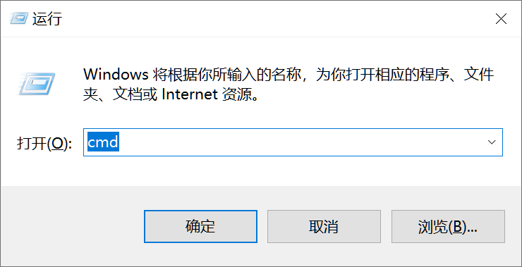

### 1.打开anaconda

然后输入以下命令以打开Anaconda命令提示符，效果如下图所示

```cmd
conda.bat activate base
```

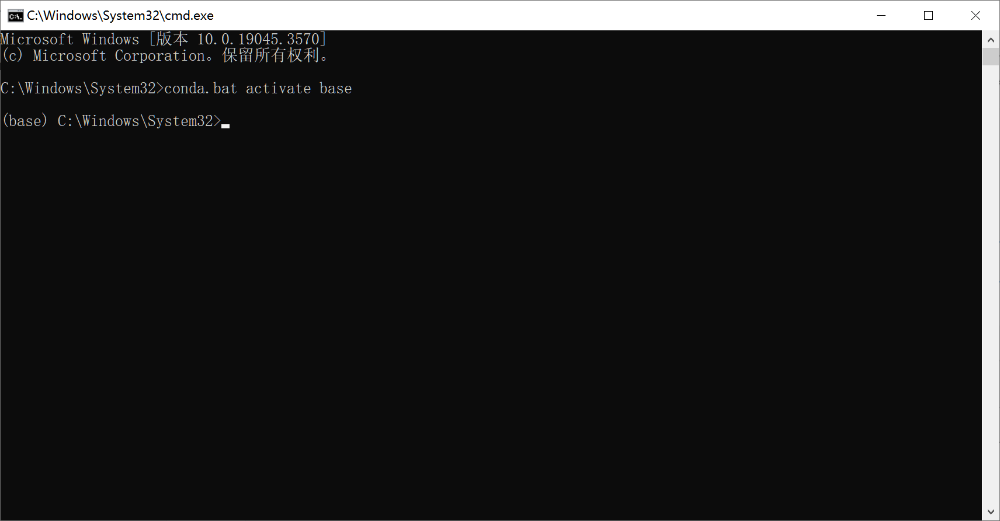


### 2.创建虚拟环境

这里的 **test_python** 可以换成你自己想要的名字，此处作者只是作为测试，当完成后会将其删除。

```cmd
conda create -n test_python python=3.8
```


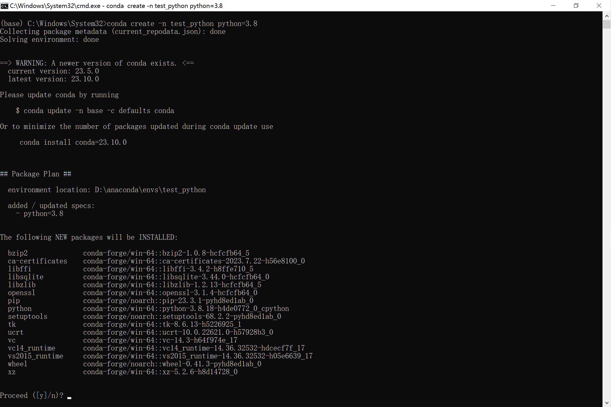


**注意** ：当下载出现网络问题时，一个可能的原因是使用了**加速器** 例如 **clash** ，只需将代理关闭即可，[详细步骤](###下载一个第三方包)。


### 3.打开虚拟环境

#### 查看所有虚拟环境

```cmd
conda env list
```

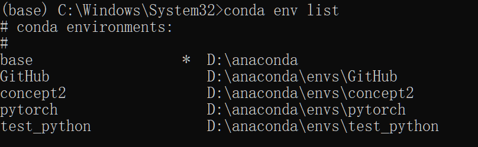


#### 打开所需环境

要激活所需环境，可以使用以下命令：

```cmd
activate test_python
```

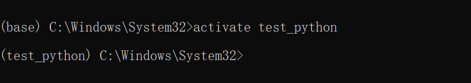


#### 下载一个第三方包

此处作者使用了 **clash** 加速器，会出现网络错误问题， 此时仅需关闭代理即可。

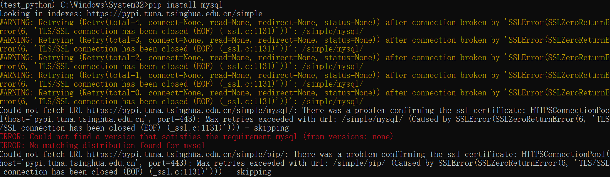

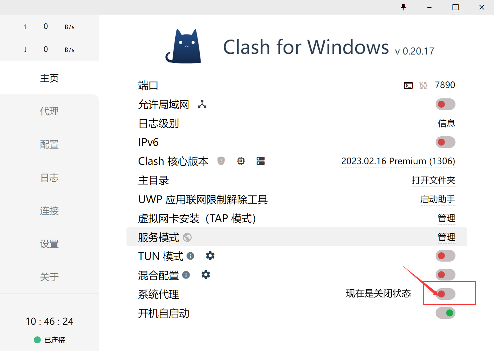

安装成功

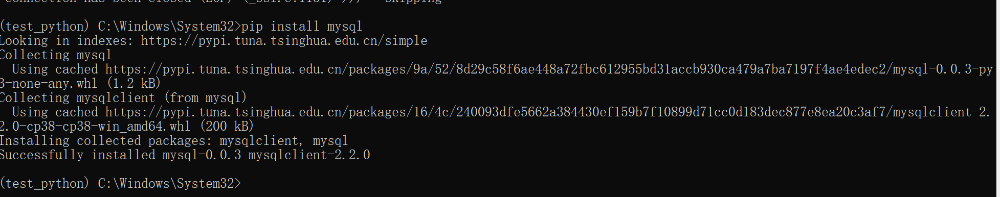


## 二.vscode选择虚拟环境

### 1.python扩展

这是作者所使用的python扩展，本文档基于此配置所编写，不一定具有一般性，仅供读者参考。

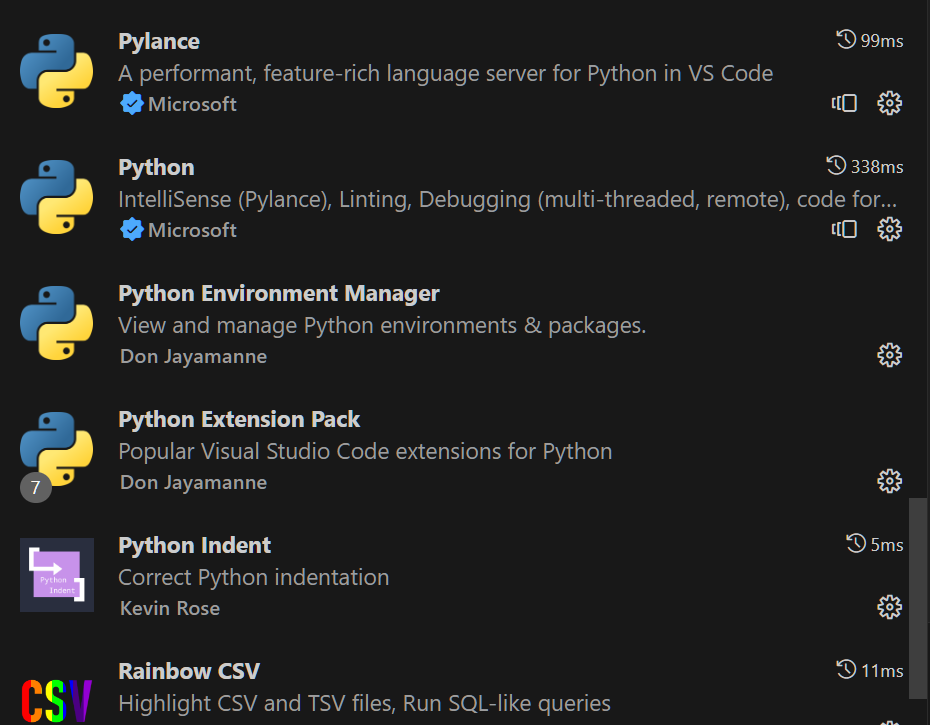


### 2.切换环境

按下快捷键 **Ctrl** + **`** 打开终端，选择所需的虚拟环境。

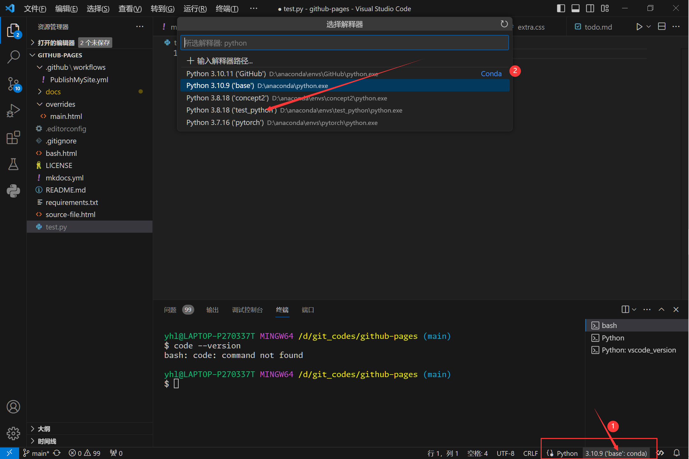

### 3,.运行代码，测试环境

由于第一种方案可直接使用，本文不做展示，读者可自行验证。

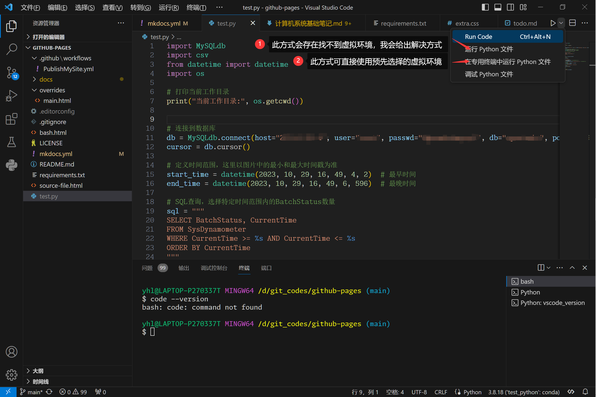


### 4.设置lanuch配置文件

按照如下步骤，添加配置文件，当完成了以下步骤后，调试代码时也会自动选择该虚拟环境，因此建议使用第二种方案。


$$
运行 \rightarrow 添加配置 \rightarrow python文件
$$

```json
{
    // 使用 IntelliSense 了解相关属性。 
    // 悬停以查看现有属性的描述。
    // 欲了解更多信息，请访问: https://go.microsoft.com/fwlink/?linkid=830387
    "version": "0.2.0",
    "configurations": [
        {
            "name": "Python: 当前文件",
            "type": "python",
            "request": "launch",
            "program": "${file}",
            "console": "integratedTerminal",
            "justMyCode": true,
            "python":"${command:python.interpreterPath}"
        }
    ]
}
```


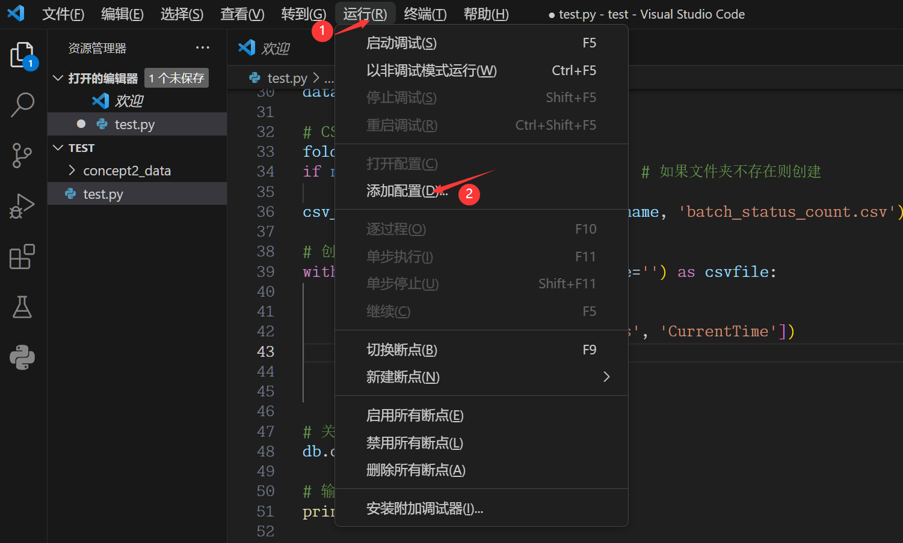

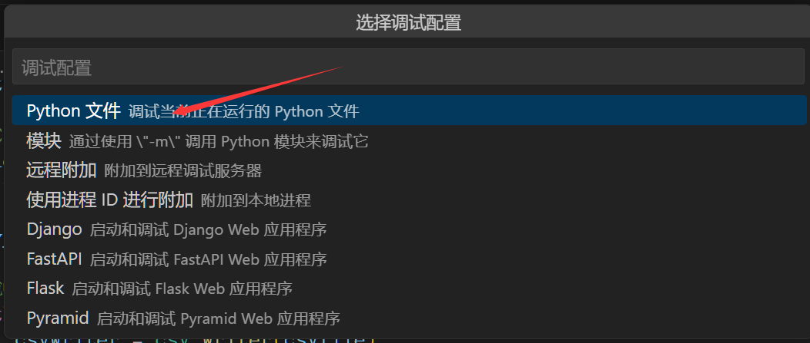

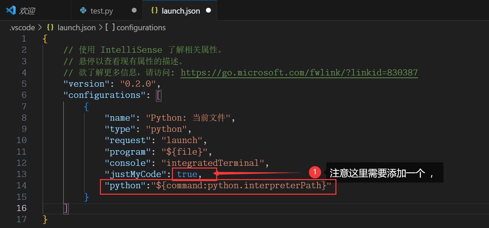

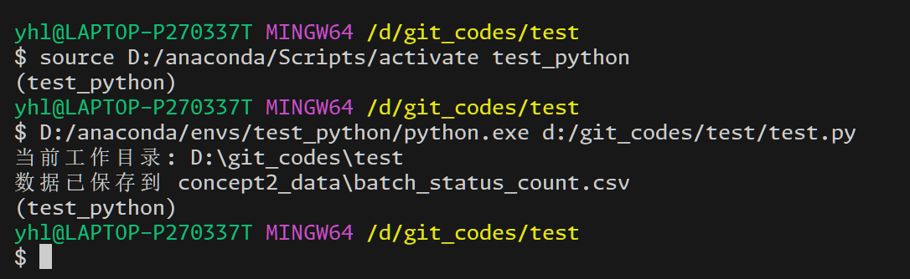


## 三. 删除虚拟环境

### 1.退出当前虚拟环境

```cmd
conda deactivate
```


### 2.删除虚拟环境

```cmd
conda env remove -n test_python
```


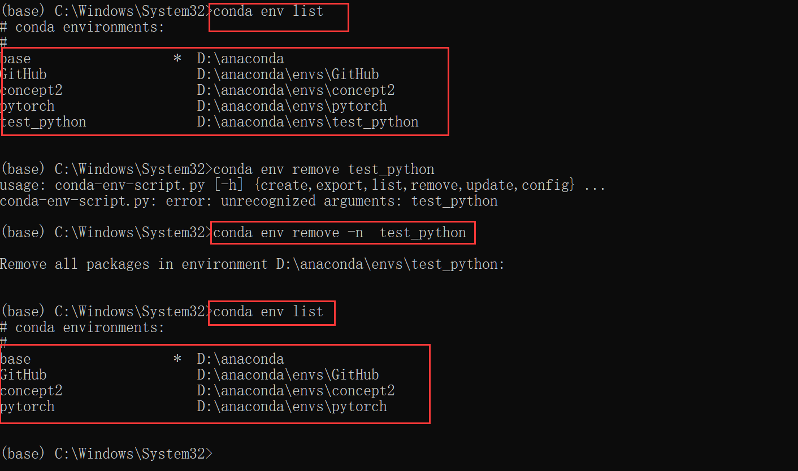


通过上述步骤，你可以在Windows 10上使用Anaconda创建、管理和删除虚拟环境，并在VSCode中进行环境切换。希望这篇文档对您有所帮助，本文到此结束。