# faster-rcnn-学习笔记

该笔记基于[**B站up主：Bubbliiiing**](https://www.bilibili.com/video/BV1BK41157Vs?p=1&vd_source=7cbfb227bb3d5386a067808fd725b17b)的视频讲解编写

[**源码地址：https://github.com/bubbliiiing/faster-rcnn-pytorch**](https://github.com/bubbliiiing/faster-rcnn-pytorch)

[**作者博客地址：https://blog.csdn.net/weixin_44791964/article/details/105739918**](https://blog.csdn.net/weixin_44791964/article/details/105739918)

**参考资料：**[一文读懂Faster RCNN](https://zhuanlan.zhihu.com/p/31426458) 

## 一、faster-rcnn介绍

​	计算机如何确定一张图片的目标的位置呢？只需要传入四个参数。

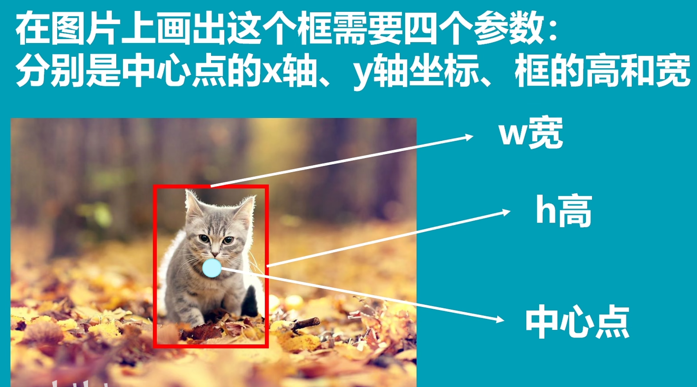


​	当一张图片传入faster-rcnn中会被resize到最小边是600的shape上，长宽比保持不变，然后将图片传入主干网络(backbone),图片被分割成$38\times38$的特征层（网格），每个网格存在若干个先验框。

### 1.使用RPN生成建议框

- RPN网络结构
  - RPN结构，有两条线。上面一条通过softmax分类anchors获得positive和negative分类，下面一条用于计算对于anchors的bounding box regression偏移量，以获得精确的proposal。
  - 最后的Proposal层则负责综合positive anchors和对应bounding box regression偏移量获取修正后的proposals，同时剔除太小和超出边界的proposals。其实整个网络到了Proposal Layer这里，就完成了相当于目标定位的功能。
  - 在拿到feature map后，先经过一个3x3卷积。

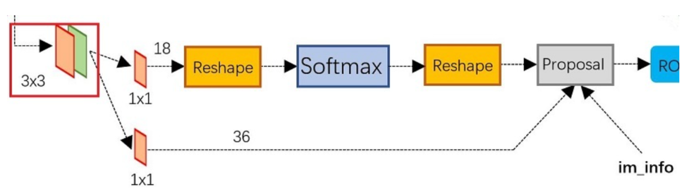

- 生成候选框的过程包括两个关键步骤：
  - 锚框生成（Anchor Box Generation）：在滑动窗口的每个位置，RPN在不同尺度和长宽比的锚框上生成多个候选框。这些锚框是预定义的一组矩形框，固定大小但具有不同尺度和长宽比。
  - 候选框分类和回归：对于每个锚框，RPN通过卷积操作将其映射到一个低维特征向量。然后，这个特征向量被用于预测锚框中是否包含目标以及对应的边界框回归参数。通过分类和回归的操作，RPN可以筛选出具有高目标可能性的建议框，并根据预测的边界框回归参数调整建议框位置。

- 特征层截取
  - 通过建议框在特征层上进行截取，截取到的不同特征层就能反映原图的不同位置

- anchor

  - 所谓anchors，实际上就是一组由rpn/generate_anchors.py生成的矩形。直接运行作者demo中的generate_anchors.py可以得到以下输出：

    ```json
    其中每行的4个值(x1,y1,x2,y2)表矩形左上和右下角点坐标,9个矩形共有3种形状。这9个anchor的大小按照三种长宽比ratio[1:1，1:2，2:1]设置，具体大小根据输入图像的原始目标大小灵活设置。
    [[ -84.  -40.   99.   55.]
     [-176.  -88.  191.  103.]
     [-360. -184.  375.  199.]
     [ -56.  -56.   71.   71.]
     [-120. -120.  135.  135.]
     [-248. -248.  263.  263.]
     [ -36.  -80.   51.   95.]
     [ -80. -168.   95.  183.]
     [-168. -344.  183.  359.]]
    ```

    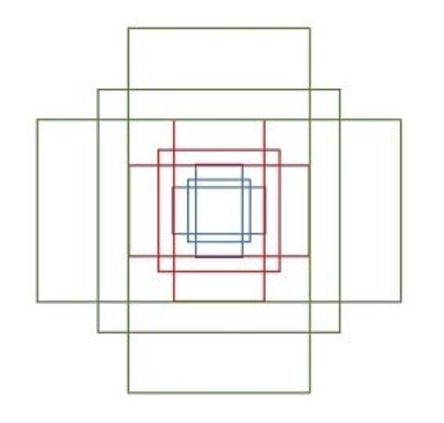

- 分类

  - 分类任务是指将候选框中的目标进行分类，确定其所属的类别。通常情况下，分类任务使用softmax函数作为激活函数，将候选框对应的特征映射为各个类别的概率分布。通过比较各个类别的概率分数，可以确定候选框最可能属于哪个类别。
  - 通过1x1卷积得到的输出，该1x1卷积的caffe prototxt定义如下：
  - 经过该卷积的输出图像为WxHx18大小,对应了feature maps每一个点都有9个anchors，同时每个anchors又有可能是positive和negative，所有这些信息都保存WxHx(9*2)大小的矩阵

  ```python
  layer {
    name: "rpn_cls_score"
    type: "Convolution"
    bottom: "rpn/output"
    top: "rpn_cls_score"
    convolution_param {
      num_output: 18   # 2(positive/negative) * 9(anchors)
      kernel_size: 1 pad: 0 stride: 1
    }
  }
  ```

  - 因为这里是二分类判断positive和negative，所以该feature map上每个点的每个anchor对应2个值，表示目标和背景的概率
  - Reshape层是技术细节问题，对feature map进行维度变换，使得有一个单独的维度为2，方便在该维度上进行softmax操作，之后再Reshape恢复原状。
  - 后面接softmax分类获得positive anchors，也就相当于初步提取了选目标框（bounding box）

  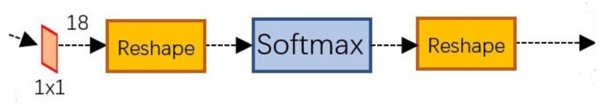

- 回归

  - 回归任务是指对候选框的精确位置进行调整，以更好地匹配目标的真实位置。回归任务通常使用回归器来预测候选框的偏移量，其中包括水平和垂直方向上的平移量以及宽度和高度的缩放比例。这些预测的偏移量可以应用于候选框的初始位置和尺寸，以获得更精确的目标位置。
  - 如图所示绿色框为飞机的Ground Truth(GT)，红色为提取的positive anchors，即便红色的框被分类器识别为飞机，但是由于红色的框定位不准，这张图相当于没有正确的检测出飞机。所以我们希望采用一种方法对红色的框进行微调，使得positive anchors和GT更加接近。

  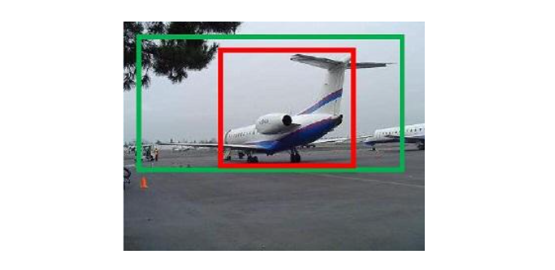

  - 通过1x1卷积得到的输出，该1x1卷积的caffe prototxt定义如下：

  ```python
  layer {
    name: "rpn_bbox_pred"
    type: "Convolution"
    bottom: "rpn/output"
    top: "rpn_bbox_pred"
    convolution_param {
      num_output: 36   # 4 * 9(anchors)
      kernel_size: 1 pad: 0 stride: 1
    }
  }
  ```

  - 经过该卷积输出图像为WxHx36，在caffe blob存储为[1, 4x9, H, W]，这里相当于feature maps每个点都有9个anchors，每个anchors又都有4个用于回归的变换量。

  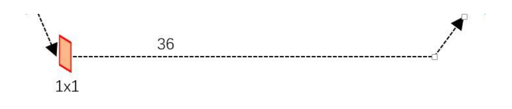

​	**其实RPN最终就是在原图尺度上，设置了密密麻麻的候选Anchor。然后用cnn去判断哪些Anchor是里面有目标的positive anchor，哪些是没目标的negative anchor。所以，仅仅是个二分类而已**

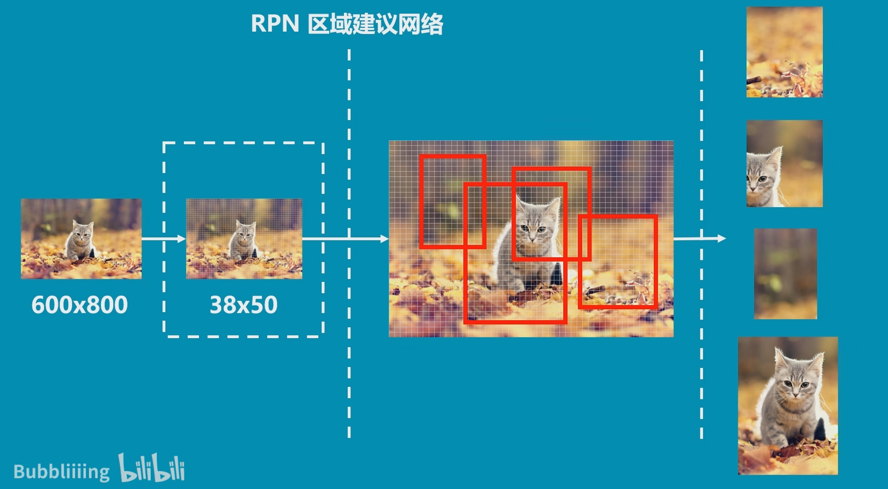


### 2.ROI pooling层

​	ROI pooling层将截取到的不同大小的特征层区域resize到同样大小，再通过分类与回归网络来判断截取的区域是否有目标，并对建议框进行调整，这个结果就是最终的结果。

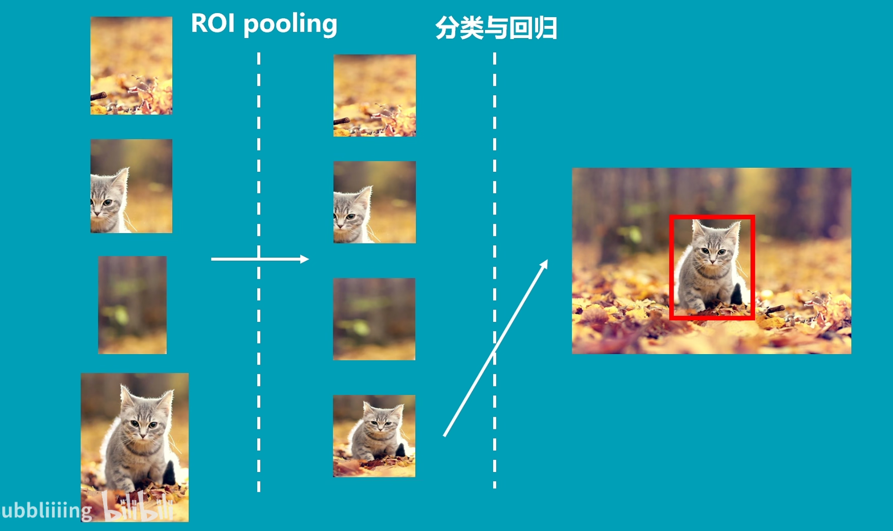

- 当feature map传入ROI pooling层中，利用建议框对feature map进行截取

- ROI pooling层会对所有的feature map进行分区域池化，使得所有的shape相同。

- 接着使用得到的feature map进行分类和回归

- 回归预测会对建议框进行调整，而分类预测会判断建议框中是否真的存在目标 。

  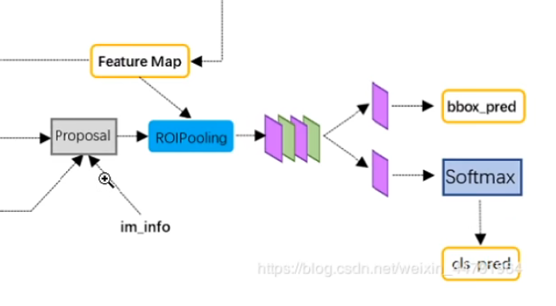

### 3.小结

​	faster-rcnn将预测过程分为两步

- 粗略的筛选（建议框）
- 精细的调整（回归，预测）

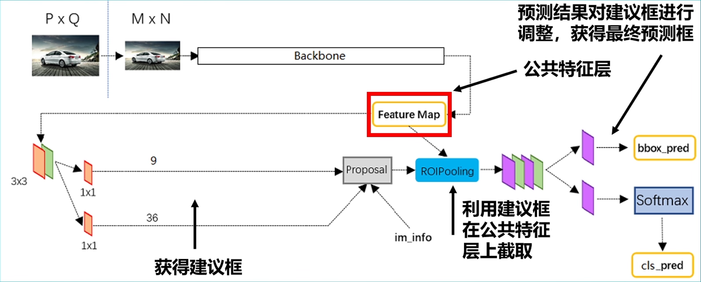


## 二、主干网络（backbone）

​	本文档使用ResNet50作为主干网络。

### 1.ResNet50基本模块

两者均为残差网络

- **Conv Block**

  - 该模块输入和输出不想同，不能进行连续串联，主要用于改变网络围维度
  - 残差边有卷积（通过改变卷积的步长和通道数改变输出特征层的通道数）
  - 结构如下:

  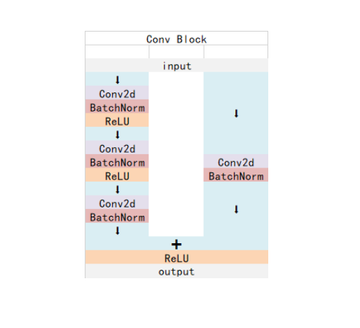

- **Identity Block**

  - 输入维度和输出维度相同，可以串联，用于加深网络。
  - 结构如下：

  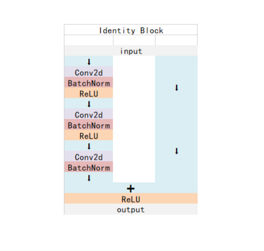

### 2.Bottleneck

```python
class Bottleneck(nn.Module):
    expansion = 4
    def __init__(self, inplanes, planes, stride=1, downsample=None):
        super(Bottleneck, self).__init__()
        self.conv1 = nn.Conv2d(inplanes, planes, kernel_size=1, stride=stride, bias=False)
        self.bn1 = nn.BatchNorm2d(planes)

        self.conv2 = nn.Conv2d(planes, planes, kernel_size=3, stride=1, padding=1, bias=False)
        self.bn2 = nn.BatchNorm2d(planes)

        self.conv3 = nn.Conv2d(planes, planes * 4, kernel_size=1, bias=False)
        self.bn3 = nn.BatchNorm2d(planes * 4)

        self.relu = nn.ReLU(inplace=True)
        self.downsample = downsample
        self.stride = stride

    def forward(self, x):
        residual = x

        out = self.conv1(x)
        out = self.bn1(out)
        out = self.relu(out)

        out = self.conv2(out)
        out = self.bn2(out)
        out = self.relu(out)

        out = self.conv3(out)
        out = self.bn3(out)
        if self.downsample is not None:
            residual = self.downsample(x)

        out += residual
        out = self.relu(out)

        return out
```

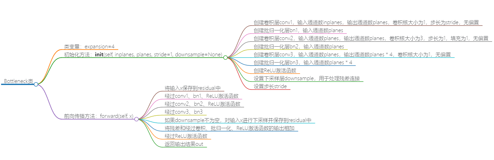

​	这段代码定义了一个Bottleneck块，它是ResNet中的基本模块之一。Bottleneck块通过降低特征图的维度，减少计算量，同时通过跳跃连接保留低层特征，提高模型的性能。

下面是对这段代码的解释：

- `expansion = 4`：扩展系数，用于将输入通道数扩展到输出通道数的倍数。
- `__init__`方法：初始化函数，定义了Bottleneck块的结构。它接受输入通道数`inplanes`、输出通道数`planes`、步长`stride`和下采样操作`downsample`作为参数。在初始化中，定义了三个卷积层和三个批归一化层，以及激活函数ReLU和降采样操作。
- `forward`方法：前向传播函数，定义了Bottleneck块的计算过程。在前向传播中，首先将输入`x`保存到`residual`中，然后通过卷积、批归一化和ReLU激活函数进行特征提取。接着，通过第三个卷积层和批归一化层将特征图的通道数扩展到输入通道数的四倍。如果存在（残差边上有卷积）下采样操作，则对输入`x`进行下采样操作。最后，将下采样结果与特征图相加，并再次经过ReLU激活函数。

​	Bottleneck块的设计可以有效地减少模型的参数量和计算量，同时通过跳跃连接传递低层特征信息，提高模型的表达能力和性能。

​	首先通过 $1\times1$ 的卷积压缩通道数，接着使用 $3\times3$ 卷积进行特征提取，再利用 $1\times 1$ 卷积扩张通道数，这样的一个瓶颈结构可以更好的提取特征加深整个网络，减少参数量。

1. 1x1卷积的作用是降低输入通道的维度。在Bottleneck块中，首先使用1x1卷积将输入通道数从`inplanes`降低到`planes`，这样可以减少后续3x3卷积的计算量和参数量。因为1x1卷积的参数量只取决于输入通道数和输出通道数，与输入特征图的尺寸大小无关。
2. 3x3卷积用于进行特征提取。通过使用较小的卷积核，可以在保持接受野（receptive field）大小的同时，减少卷积操作的计算量和参数量。相比于使用较大的卷积核，3x3卷积可以在更少的参数量下实现类似的感受野。

### 3. ResNet

```python
class ResNet(nn.Module):
    def __init__(self, block, layers, num_classes=1000):
        #-----------------------------------#
        #   假设输入进来的图片是600,600,3
        #-----------------------------------#
        self.inplanes = 64
        super(ResNet, self).__init__()

        # 600,600,3 -> 300,300,64
        self.conv1 = nn.Conv2d(3, 64, kernel_size=7, stride=2, padding=3, bias=False)
        self.bn1 = nn.BatchNorm2d(64)
        self.relu = nn.ReLU(inplace=True)

        # 300,300,64 -> 150,150,64
        self.maxpool = nn.MaxPool2d(kernel_size=3, stride=2, padding=0, ceil_mode=True)

        # 150,150,64 -> 150,150,256
        self.layer1 = self._make_layer(block, 64, layers[0])
        # 150,150,256 -> 75,75,512
        self.layer2 = self._make_layer(block, 128, layers[1], stride=2)
        # 75,75,512 -> 38,38,1024 到这里可以获得一个38,38,1024的共享特征层
        self.layer3 = self._make_layer(block, 256, layers[2], stride=2)
        # self.layer4被用在classifier模型中
        self.layer4 = self._make_layer(block, 512, layers[3], stride=2)
        
        self.avgpool = nn.AvgPool2d(7)
        self.fc = nn.Linear(512 * block.expansion, num_classes)

        for m in self.modules():
            if isinstance(m, nn.Conv2d):
                n = m.kernel_size[0] * m.kernel_size[1] * m.out_channels
                m.weight.data.normal_(0, math.sqrt(2. / n))
            elif isinstance(m, nn.BatchNorm2d):
                m.weight.data.fill_(1)
                m.bias.data.zero_()

    def _make_layer(self, block, planes, blocks, stride=1):
        downsample = None
        #-------------------------------------------------------------------#
        #   当模型需要进行高和宽的压缩的时候，就需要用到残差边的downsample
        #-------------------------------------------------------------------#
        if stride != 1 or self.inplanes != planes * block.expansion:
            downsample = nn.Sequential(
                nn.Conv2d(self.inplanes, planes * block.expansion,kernel_size=1, stride=stride, bias=False),
                nn.BatchNorm2d(planes * block.expansion),
            )
        layers = []
        layers.append(block(self.inplanes, planes, stride, downsample))
        self.inplanes = planes * block.expansion
        for i in range(1, blocks):
            layers.append(block(self.inplanes, planes))
        return nn.Sequential(*layers)

    def forward(self, x):
        x = self.conv1(x)
        x = self.bn1(x)
        x = self.relu(x)
        x = self.maxpool(x)

        x = self.layer1(x)
        x = self.layer2(x)
        x = self.layer3(x)
        x = self.layer4(x)

        x = self.avgpool(x)
        x = x.view(x.size(0), -1)
        x = self.fc(x)
        return x

```

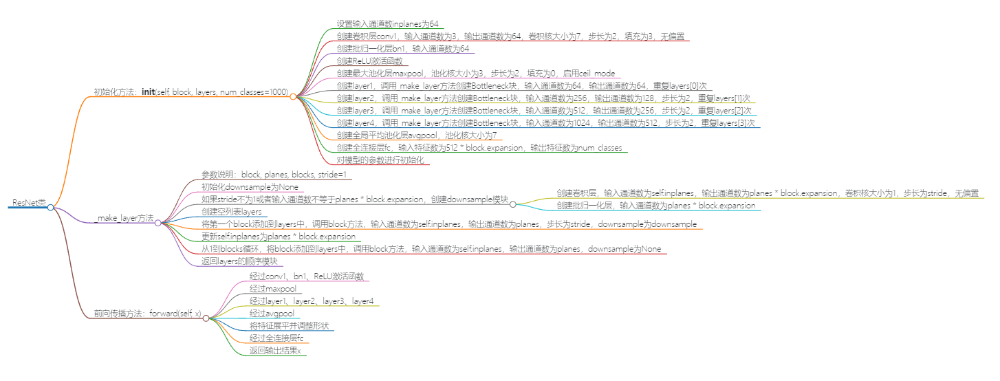

​	`ResNet`类通过调用`_make_layer`方法来构建多个`Bottleneck`块，将它们组合成一个完整的ResNet模型。`ResNet`类是整个模型的骨架，而`Bottleneck`类是模型中的基本模块。通过不同的块的堆叠，可以构建不同深度的ResNet模型。`ResNet`是一个完整的深度卷积神经网络模型，而`Bottleneck`是ResNet模型中的一个基本构建块。

​	Faster-RCNN的主干特征提取网络部分只包含了长宽压缩了四次的内容，第五次压缩后的内容在ROI中使用。即Faster-RCNN在主干特征提取网络所用的网络层如图所示。

以输入的图片为600x600为例，shape变化如下：

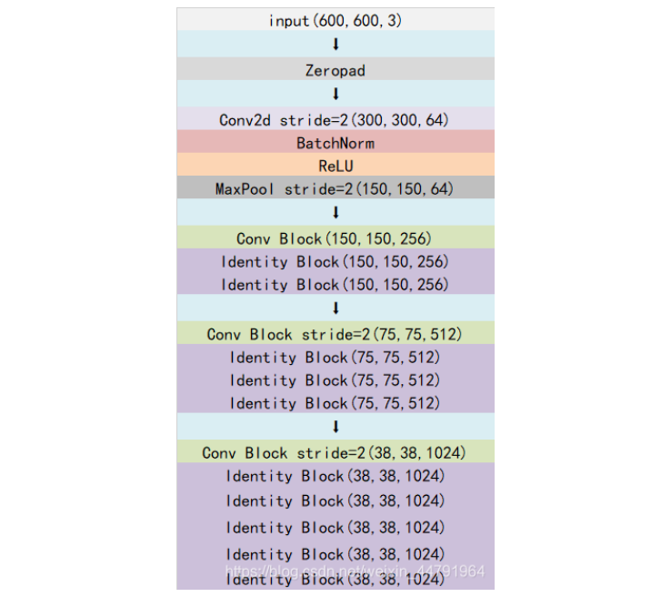


## 三、Proposal

### 1.RegionProposalNetwork

**获得Proposal建议框**

​	主干网络获得的Feature Map，其有两个应用，一个是和ROIPooling结合使用、另一个是进行一次3x3的卷积后，进行一个18通道的1x1卷积，还有一个36通道的1x1卷积。

- $9\times 4$ 卷积：
  - 用于预测 **feature map上** **每一个网格点上 每一个先验框**的变化情况。
  - **因为Faster-RCNN的预测结果需要结合先验框获得预测框，预测结果就是先验框的变化情况。**
- $9\times2$ 卷积：
  - 用于预测 **feature map上** **每一个网格点上** **每一个预测框**内部是否包含了物体，**序号为1的内容为包含物体的概率**。

​	当我们输入的图片的shape是600x600x3的时候，公用特征层的shape就是38x38x1024，相当于把输入进来的图像分割成38x38的网格，然后每个网格存在9个先验框，这些先验框有不同的大小，在图像上密密麻麻。

​	$9\times 4$的卷积的结果会对这些先验框进行调整，获得一个新的框。
​	$9 \times 2$的卷积会判断上述获得的新框是否包含物体。

​	到这里我们可以获得了一些有用的框，这些框会利用9 x 2的卷积判断是否存在物体。到此为止还只是粗略的一个框的获取，也就是一个建议框。然后我们会在建议框里面继续找东西。

- 源码：

```python
class RegionProposalNetwork(nn.Module):
    def __init__(
        self, 
        in_channels     = 512, 
        mid_channels    = 512, 
        ratios          = [0.5, 1, 2],
        anchor_scales   = [8, 16, 32], 
        feat_stride     = 16,
        mode            = "training",
    ):
        super(RegionProposalNetwork, self).__init__()
        #-----------------------------------------#
        #   生成基础先验框，shape为[9, 4]
        #-----------------------------------------#
        self.anchor_base    = generate_anchor_base(anchor_scales = anchor_scales, ratios = ratios)
        n_anchor            = self.anchor_base.shape[0]

        #-----------------------------------------#
        #   先进行一个3x3的卷积，可理解为特征整合
        #-----------------------------------------#
        self.conv1  = nn.Conv2d(in_channels, mid_channels, 3, 1, 1)
        #-----------------------------------------#
        #   分类预测先验框内部是否包含物体
        #-----------------------------------------#
        self.score  = nn.Conv2d(mid_channels, n_anchor * 2, 1, 1, 0)
        #-----------------------------------------#
        #   回归预测对先验框进行调整
        #-----------------------------------------#
        self.loc    = nn.Conv2d(mid_channels, n_anchor * 4, 1, 1, 0)

        #-----------------------------------------#
        #   特征点间距步长
        #-----------------------------------------#
        self.feat_stride    = feat_stride
        #-----------------------------------------#
        #   用于对建议框解码并进行非极大抑制
        #-----------------------------------------#
        self.proposal_layer = ProposalCreator(mode)
        #--------------------------------------#
        #   对FPN的网络部分进行权值初始化
        #--------------------------------------#
        normal_init(self.conv1, 0, 0.01)
        normal_init(self.score, 0, 0.01)
        normal_init(self.loc, 0, 0.01)

    def forward(self, x, img_size, scale=1.):
        n, _, h, w = x.shape
        #-----------------------------------------#
        #   先进行一个3x3的卷积，可理解为特征整合
        #-----------------------------------------#
        x = F.relu(self.conv1(x))
        #-----------------------------------------#
        #   回归预测对先验框进行调整
        #-----------------------------------------#
        rpn_locs = self.loc(x)
        rpn_locs = rpn_locs.permute(0, 2, 3, 1).contiguous().view(n, -1, 4)
        #-----------------------------------------#
        #   分类预测先验框内部是否包含物体
        #-----------------------------------------#
        rpn_scores = self.score(x)
        rpn_scores = rpn_scores.permute(0, 2, 3, 1).contiguous().view(n, -1, 2)
        
        #--------------------------------------------------------------------------------------#
        #   进行softmax概率计算，每个先验框只有两个判别结果
        #   内部包含物体或者内部不包含物体，rpn_softmax_scores[:, :, 1]的内容为包含物体的概率
        #--------------------------------------------------------------------------------------#
        rpn_softmax_scores  = F.softmax(rpn_scores, dim=-1)
        rpn_fg_scores       = rpn_softmax_scores[:, :, 1].contiguous()
        rpn_fg_scores       = rpn_fg_scores.view(n, -1)

        #------------------------------------------------------------------------------------------------#
        #   生成先验框，此时获得的anchor是布满网格点的，当输入图片为600,600,3的时候，shape为(12996, 4)
        #------------------------------------------------------------------------------------------------#
        anchor = _enumerate_shifted_anchor(np.array(self.anchor_base), self.feat_stride, h, w)
        rois        = list()
        roi_indices = list()
        for i in range(n):
            roi         = self.proposal_layer(rpn_locs[i], rpn_fg_scores[i], anchor, img_size, scale = scale)
            batch_index = i * torch.ones((len(roi),))
            rois.append(roi.unsqueeze(0))
            roi_indices.append(batch_index.unsqueeze(0))

        rois        = torch.cat(rois, dim=0).type_as(x)
        roi_indices = torch.cat(roi_indices, dim=0).type_as(x)
        anchor      = torch.from_numpy(anchor).unsqueeze(0).float().to(x.device)
        
        return rpn_locs, rpn_scores, rois, roi_indices, anchor

```

根据这段代码，可以生成以下思维导图大纲：

- RegionProposalNetwork类
  - 初始化方法：__init__(self, in_channels=512, mid_channels=512, ratios=[0.5, 1, 2], anchor_scales=[8, 16, 32], feat_stride=16, mode="training")
    - 创建基础先验框anchor_base，形状为[9, 4]
    - 获取先验框的数量n_anchor
    - 创建卷积层conv1，输入通道数为in_channels，输出通道数为mid_channels，卷积核大小为3，步长为1，填充为1
    - 创建分类预测层score，输入通道数为mid_channels，输出通道数为n_anchor * 2，卷积核大小为1，步长为1，填充为0
    - 创建回归预测层loc，输入通道数为mid_channels，输出通道数为n_anchor * 4，卷积核大小为1，步长为1，填充为0
    - 设置特征点间距步长feat_stride
    - 创建ProposalCreator对象proposal_layer，用于对建议框进行解码和非极大抑制
    - 对conv1、score、loc的权值进行初始化

  - 前向传播方法：forward(self, x, img_size, scale=1.)
    - 获取输入特征图x的形状
    - 经过卷积层conv1并使用ReLU激活函数
    - 经过回归预测层loc，并调整形状
    - 经过分类预测层score，并调整形状
    - 对分类预测得分进行softmax概率计算，得到包含物体的概率rpn_fg_scores
    - 生成先验框anchor，并进行偏移、缩放等调整
    - 使用ProposalCreator对先验框进行解码和非极大抑制，得到建议框rois和对应的图像索引roi_indices
    - 返回rpn_locs、rpn_scores、rois、roi_indices和anchor

```python
		#-----------------------------------------#
        #   先进行一个3x3的卷积，可理解为特征整合
        #-----------------------------------------#
        self.conv1  = nn.Conv2d(in_channels, mid_channels, 3, 1, 1)
        #-----------------------------------------#
        #   分类预测先验框内部是否包含物体
        #-----------------------------------------#
        self.score  = nn.Conv2d(mid_channels, n_anchor * 2, 1, 1, 0)
        #-----------------------------------------#
        #   回归预测对先验框进行调整
        #-----------------------------------------#
        self.loc    = nn.Conv2d(mid_channels, n_anchor * 4, 1, 1, 0)

        
        
		n, _, h, w = x.shape
        #-----------------------------------------#
        #   先进行一个3x3的卷积，可理解为特征整合
        #-----------------------------------------#
        x = F.relu(self.conv1(x))
        #-----------------------------------------#
    	#   回归预测对先验框进行调整
        #-----------------------------------------#
        rpn_locs = self.loc(x)
        rpn_locs = rpn_locs.permute(0, 2, 3, 1).contiguous().view(n, -1, 4)
        
'''
以下是对代码rpn_locs.permute(0, 2, 3, 1).contiguous().view(n, -1, 4)中每一步操作的解释：

rpn_locs.permute(0, 2, 3, 1): 这一步通过调用permute函数对rpn_locs进行维度置换操作。使用参数(0, 2, 3, 1)将原始的维度顺序(batch_size, channels, height, width)变换为(batch_size, height, width, channels)。这样做的目的是为了后续的contiguous操作做准备。

contiguous(): 这一步调用contiguous函数，将重新排列维度后的rpn_locs张量变为连续的内存布局。因为在进行view操作之前，需要保证张量是连续的，否则会出现错误。

view(n, -1, 4): 这一步调用view函数，将rpn_locs张量进行形状变换。参数(n, -1, 4)中，n表示batch大小，-1表示自动计算该维度的大小，4表示每个先验框的回归预测结果的维度。这样操作的目的是将rpn_locs从原始的形状(batch_size, height, width, channels)变换为形状为(batch_size, -1, 4)的张量，第二维度的内容变为了每一个先验框，其中-1的大小会根据其他维度的大小自动计算。

综合起来，上述代码的作用是将rpn_locs张量进行维度置换、内存连续化和形状变换操作，最终得到形状为(batch_size, -1, 4)的张量。其中每个元素表示一个先验框的回归预测结果，具有4个值用于表示坐标偏移量。
'''

        #-------------------------------------------------------------------------------#
        #   进行softmax概率计算，每个先验框只有两个判别结果
        #   内部包含物体或者内部不包含物体，rpn_softmax_scores[:, :, 1]的内容为包含物体的概率
        #-------------------------------------------------------------------------------#
        rpn_softmax_scores  = F.softmax(rpn_scores, dim=-1)
        rpn_fg_scores       = rpn_softmax_scores[:, :, 1].contiguous()
        rpn_fg_scores       = rpn_fg_scores.view(n, -1)
        
'''
上述代码片段的作用是对分类预测结果进行softmax概率计算，以及提取包含物体的概率。

F.softmax(rpn_scores, dim=-1): 这一行代码使用F.softmax函数对rpn_scores进行softmax概率计算。rpn_scores是分类预测的输出结果，它的形状为(batch_size, num_anchors, 2)，其中2表示两个判别结果（内部包含物体或者内部不包含物体）。softmax函数将每个先验框的两个判别结果转换为一个概率分布，使得每个判别结果的值介于0和1之间，并且所有值的和为1。

rpn_softmax_scores[:, :, 1].contiguous(): 这一行代码提取了经过softmax概率计算后的结果中，表示包含物体的概率值。rpn_softmax_scores的形状为(batch_size, num_anchors, 2)，通过使用索引[:, :, 1]将包含物体的概率值提取出来。结果是一个形状为(batch_size, num_anchors)的张量。

rpn_fg_scores.view(n, -1): 这一行代码对提取出来的包含物体的概率值进行形状变换。rpn_fg_scores的形状为(batch_size, num_anchors)，通过调用view函数，将其变换为形状为(n, -1)的张量，其中n表示batch大小，-1表示自动计算该维度的大小。这样操作的目的是为了方便后续处理。

综合起来，上述代码的作用是对分类预测结果进行softmax概率计算，提取出表示包含物体的概率值，并将其进行形状变换，得到形状为(n, -1)的张量，其中每个元素表示一个先验框内部包含物体的概率值。
'''
```


### 2.Proposal建议框的解码

- 先验框
- 调用`anchors.py`结果

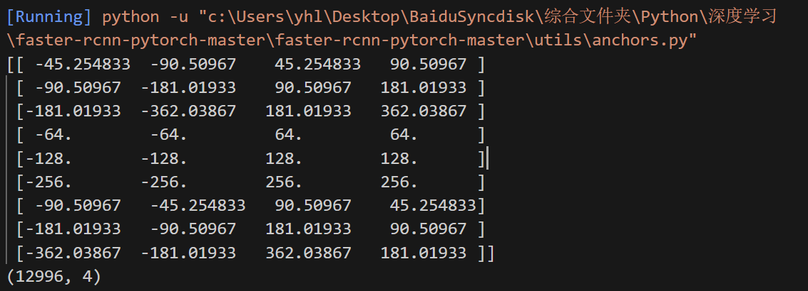

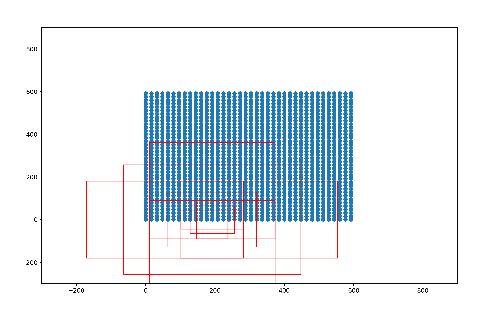

- 建议框生成过程
