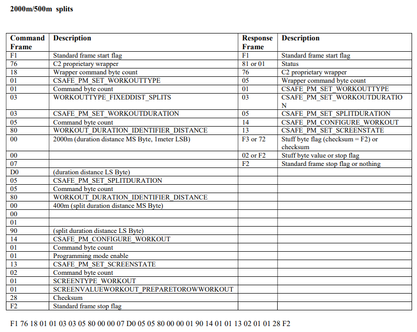
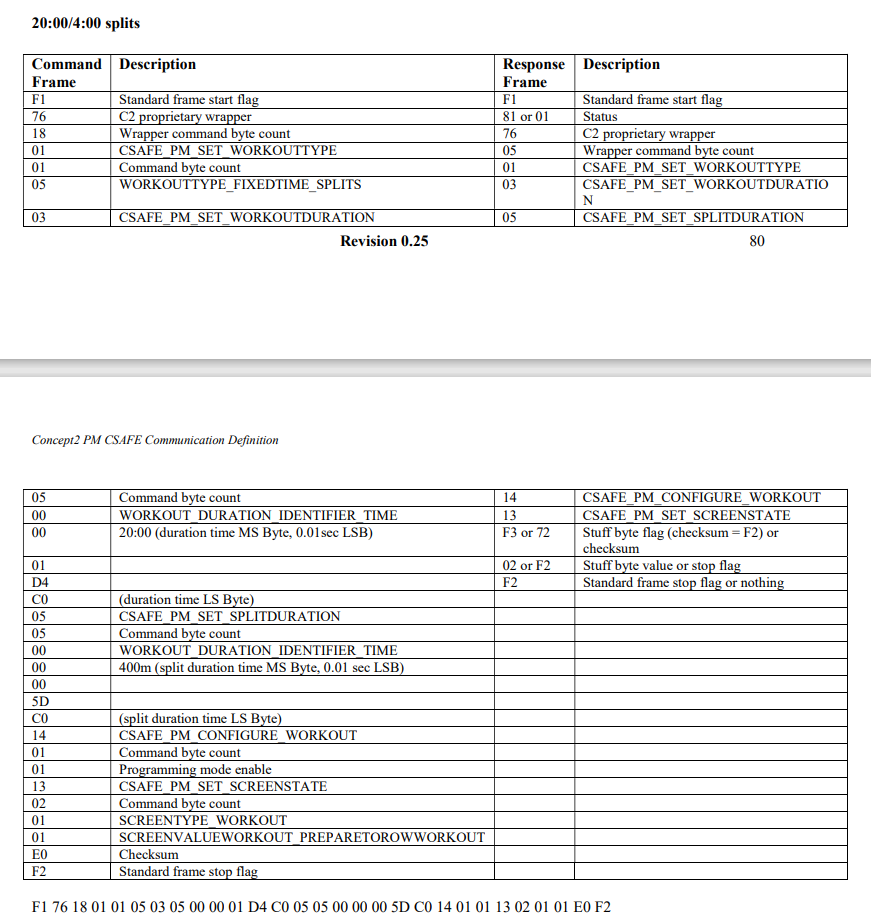
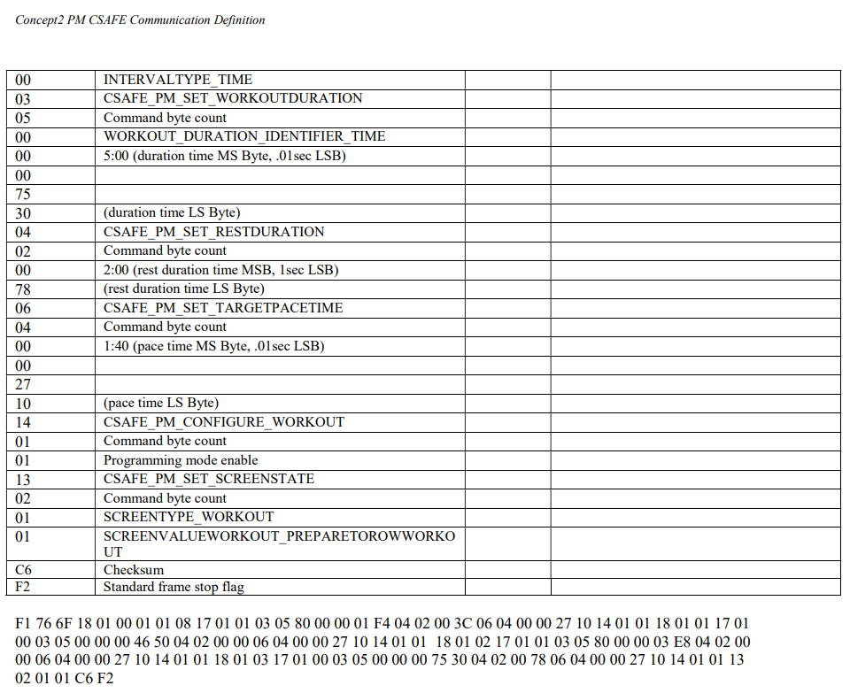
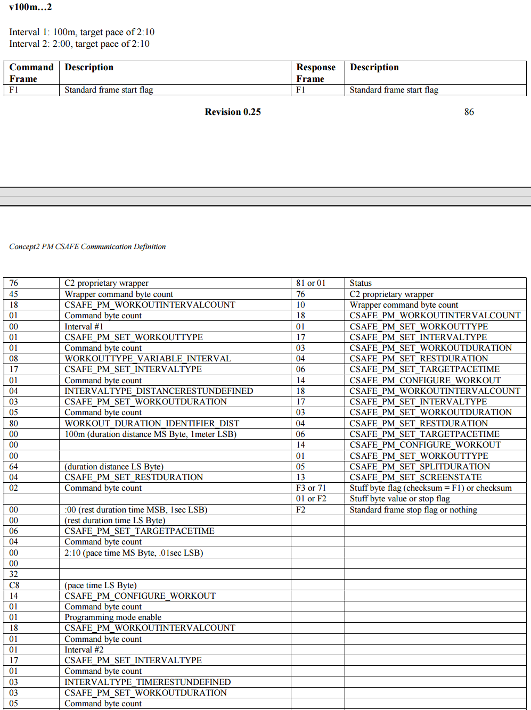
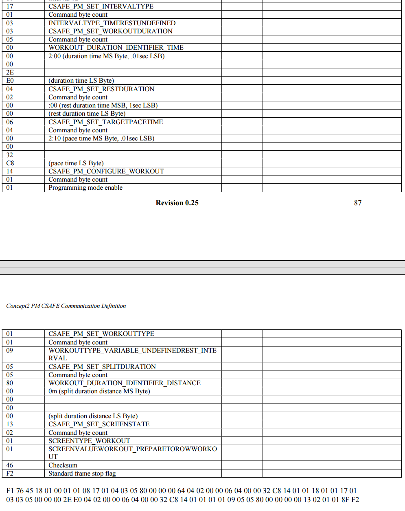

# concept2下发设置命令

本文档是叙述如何构建合适的指令，使用官方提供的API接口向concept2划船机发送预定义命令。

本文档不保证完全准确，仅做参考使用，请使用者切勿盲从。

## 1. 注意事项

- 发送以下命令需先用蓝牙与表头相连
- 构建命令字符数量最大值为120
- 下发指令可使用官方提供`PMSDKDemo`

​		[PMSDKDemo下载地址](https://www.concept2.com/service/software/software-development)

## 2.校验和计算

- 除去`f1、f2`将所有数据进行异或

- 示例

​	`需要计算的数据`：76 18 01 01 05 03 05 00 **00 01 d3 c1** 05 05 00 **00 00 13 71** 14 01 01 13 02 01 01

​	`校验和`：19

​	`发送命令`：f1 76 18 01 01 05 03 05 00 00 01 d3 c1 05 05 00 00 00 13 71 14 01 01 13 02 01 01 19 f2

## 3.固定时间/距离

### 1. 距离/分段

- 原始示例

该命令使用 `tkcmdsetUSB_do_DDIcommand` 发送，其发送的含义为：目标距离**2000m**，分段距离**400m**

- 自定义示例

​	**完整命令**：f1 76 18 01 01 03 03 05 80 **00 01 11 11** 05 05 80 **00 00 00 64** 14 01 01 13 02 01 01 0b f2

​	**说明**：目标距离**69905m**,分段距离**100m**

​	**00 01 11 11**：表示设定目标距离为**69905m**，以`1m`为单位

​	**00 00 00 64**：表示分段距离为**100m**，以`1m`为单位

****

### 2.时间/分段

- 原始示例

​	该命令使用 `tkcmdsetUSB_do_DDIcommand` 发送，其发送的含义为：目标时间**20min**,分段时间**4min**

- 自定义示例

​	**完整命令**：f1 76 18 01 01 05 03 05 00 **00 01 d4 c0** 05 05 00 **00 00 17 70** 14 01 01 13 02 01 01 1a f2

​	**说明**：目标时间**20min**,分段时间**1min**

​	**00 01 d4 c0**：表示设定目标时间为**20min**，以`0.01sec`为单位

​	**00 00 17 70**: 表示分段时间为**1min**，以`0.01sec`为单位

## 4.可变间隔

### 1.分段（距离/时间+休息）

**完整命令**：f1 76 6f 18 01 00 01 01 08 17 01 01 03 05 80 00 00 01 f4 04 02 00 3c 06 04 00 00 27 10 14 01 01 18 01 01 17 01 00 03 05 00 00 00 46 50 04 02 00 00 06 04 00 00 27 10 14 01 01 18 01 02 17 01 01 03 05 80 00 00 03 e8 04 02 00 00 06 04 00 00 27 10 14 01 01 18 01 03 17 01 00 03 05 00 00 00 75 30 04 02 00 78 06 04 00 00 27 10 14 01 01 13 02 01 01 09 f2

**1min*3+间隔30s**:f1 `76 43` `18 01 00 01 01 08` `17 01 00` `03 05 00 00 00 17 70` `04 02 00 1e` `14 01 01` `18 01 01` `17 01 00` `03 05 00 00 00 17 70` `04 02 00 1e ` `14 01 01` `18 01 02` `17 01 00` `03 05 00 00 00 17 70` `04 02 00 00` `14 01 01` `13 02 01 01` `53` f2

**100m*3+间隔30s**:f1 76 43 **18 01 00 01 01 08** `17 01 01` `03 05 80 00 00 00 64` `04 02 00 1e` `14 01 01` `18 01 01` `17 01 01` `03 05 80 00 00 00 64` `04 02 00 1e` `14 01 01` `18 01 02` `17 01 01` `03 05 80 00 00 00 64` `04 02 00 00` `14 01 01` `13 02 01 01` d1 f2

## 5. 未定义休息时间

**完整命令**：f1 76 45 18 01 00 01 01 08 **17 01 04** 03 05 80 00 00 00 64 04 02 00 00 06 04 00 00 32 c8 14 01 01 18 01 01 **17 01 03** 03 05 00 00 00 2e e0 04 02 00 00 06 04 00 00 32 c8 14 01 01 **01 01 09 05 05 80 00 00 00 00** 13 02 01 01 8f f2

**17 01 04**：`04`表示目标距离休息时间未定义

**17 01 03** ：`03`表示目标时间休息时间未定义

**01 01 09**：设置未定义休息时间

**100m Undefined Rest +3min  Undefined Rest**：f1 76 31 18 01 00 01 01 08 17 01 04 03 05 80 00 00 00 64 14 01 01 18 01 01 17 01 03 03 05 00 00 00 2e e0 14 01 01 01 01 09 05 05 80 00 00 00 00 13 02 01 01 fb f2

## 6.终止锻炼

**完整命令**：f1 76 04 13 02 01 02 60 f2

- ## 联系方式

  - GitHub: [yanghualv7](https://github.com/yanghualv7)
  - 邮箱: [yang2652841696@gmail.com](mailto:yang2652841696@gmail.com)